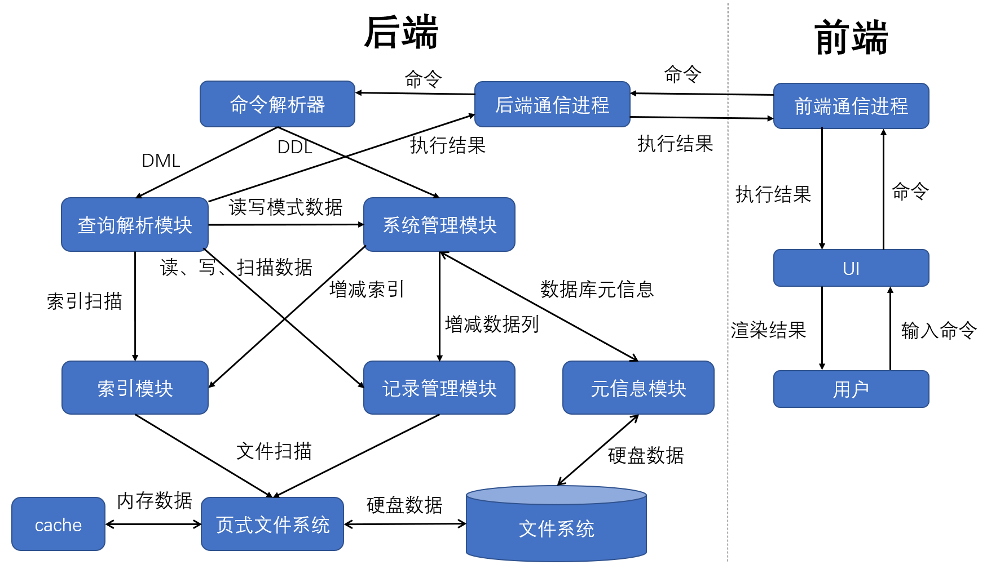
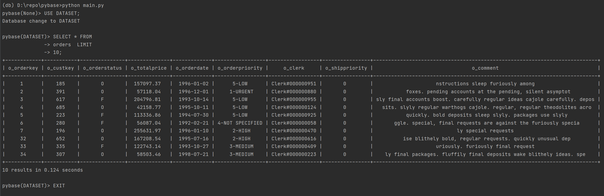
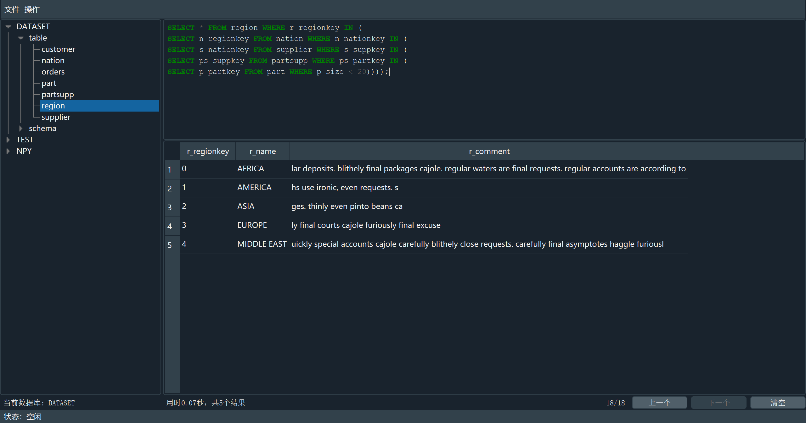

# 数据库系统概论项目报告

<center>饶淙元 董昊文 2021年1月11日</center>

## 1. 运行方法

项目支持有 GUI 的完整版与没有 GUI 的精简版。

### 1.1 精简版

需要安装 Python 3.7 或者更高的版本，然后在根目录下执行

```
pip install -r requirements.txt
```

安装依赖库后执行

```shell
python main.py
```

进入系统。

如果要执行 SQL 文件可以用

```shell
python main.py -f <path/to/file.sql>
```

如果要批量导入数据则可以用

```shell
python main.py -f path/to/csv_or_tbl -t <table_name> <data_base_name>
```

### 1.2 完整版

安装完整版需要 PyQt5 等依赖，消耗时间或许较长

```shell
pip install -r requirements_dev.txt
```

安装完依赖库后执行

```shell
python main.py --gui
```

即可进入 GUI 模式。

## 2. 系统架构设计

项目选择用 Python 完成，实现了 GUI，因此设计了前后端分离的系统并引入了多进程和多线程，和大作业文档中的设计有所出入，设计图如下：



用户将指令输入到 UI 中，UI 将将命令传给前端的通信进程，前端再利用管道将命令传给后端通信进程以执行。

后端通信进程收到命令后交给命令解析器，命令解析器将 DML 数据传给查询解析模块，DDL 数据传给系统管理模块。

系统管理模块可能需要在索引模块中增减索引，在记录管理模块中更改每条记录，在元信息模块中获取、更新数据库的元信息。

查询模块需要先从系统管理模块读写模式数据，然后在可以使用索引时借助索引模块扫描索引，此后再从记录管理模块获取具体记录。

索引模块、记录管理模块均利用页式文件系统读写数据，而元信息模块存储的数据多为 object 格式，直接访问文件系统。

页式文件系统在 cache 可用时直接访问 cache 获取数据，否则访问文件系统。

最终，查询解析模块将获取到的结果返回给后端通信进程，后端通信进程再用管道送给前端通信进程，UI 从前端通信进程获取到执行结果后渲染给用户看。

## 3. 模块详细设计

按照开发中的实现顺序，对各模块的设计描述如下。

### 3.1 页式文件系统

由于项目采用 Python 编写，因此不能直接使用作业所提供的页式文件管理系统，我重新实现了一遍。

本模块采以 8KB 为一页的大小，以 8k 页为 cache 大小，打开文件后返回一个文件号，上层模块根据文件号与页号获取数据。

模块借用一个双向环状链表实现 LRU 算法进行缓存更新，以类型为 `numpy.uint8` 的 `numpy.ndarray` 作为数据载体实现 Python 下的缓存读写。

### 3.2 记录管理模块

记录管理模块借助页式文件系统完成，采用了定长记录法。

为每张表生成了一个记录文件，首页以 `json.dumps` 的方法存储文件信息，包括记录长度、每页数量、总数量、下一个有空的页等；后面的数据页整体构成一个链表结构以显示有空位的页，每页尾部头部存有下一个空页的编号以及一个 bitmap 以表明本页有空位的位置，当需要扫描时从前往后逐页扫描，需要插入/删除时对形成的大链表与页内的 bitmap 进行维护。

该模块也定义了记录号 RID，由页号和槽号（页内的记录次序号）组成，方便索引模块筛选出 RID 后直接根据 RID 访问记录，并在需要删改记录时根据 RID 精确定位到记录位置。

### 3.3 索引模块

索引模块包括上层管理接口与底层的 B 树结构两部分，上层管理接口提供了索引到 RID 的搜索、插入、删除等功能，下层 B 树则具体保证了各种操作的高效性。

B 树部分定义了抽象类树结点 `TreeNode` 以及它的派生类内部结点 `InterNode` 和叶结点 `LeafNode`，每个结点会动态计算大小以保证能在页式文件系统的一页之内存下，采用 B 树的记录模式并利用一页的大小尽可能多地记录关键码，降低树高。

内部结点只需要记录索引数据关键码，外部结点除了关键码还需要记录相对应的 RID 数据。我们将关键码统一为 8 字节的 `long long` 或者 `double`，RID 记录为 8 字节的 `long long` 页号和 8 字节的 `long long` 槽号，在我们的参数下，一个内部结点能记录 509 个关键码，一个外部结点能记录 338 个数据结点，最终的数据规模之下树高不超过 3，时间主要用在了一个结点之内的扫描上，而一个结点内部也采用了二分查找的方法寻找边界，整体效率很高。

我们使用了一个固定的足够小的负数来记录 NULL 值，保证了 B 树的简单高效。

### 3.4 元信息模块

这里主要是为了系统管理模块服务，并供索引模块和查询解析模块获取表的模式信息。

本模块中定义了 `DbInfo` 、`TableInfo`、`ColumnInfo` 等来管理，上层模块可以凭借数据库名、表名、列名来获取它们的模式信息，由于这些信息都是以 `object` 的形式记录且注定了大小有限，因此我们直接使用 Python 内置的 `pickle` 库将它们存到文件系统中。

此外这里也包含了数据转换的子模块，从页式文件系统中获取到的记录是字节串，而上层模块处理的是列模式信息中记录的类型所对应的 Python 类型，因此这里需要实现两者的相互转化。主要利用 Python 的 `struct` 模块进行转换，系统中约定的对于类型转化规则如下：

- `INT` 上层为 Python 中的 `int`，下层记录为 8 字节 `long long`，用 `1<<32` 表示 NULL。输入字符串直接用 Python 的 `int` 构造函数转换
- `VARCAHR(n)` 上层为 Python 中的 `str`，下层记录为 n +1 字节的 定长串，其中第一个字节表示是否是 NULL，后面 n 个字节为字符串内容，实际长度小于 n 时用 `\0` 进行填充，字符串有效内容不会包括 `\0`。此外这里使用了 `utf-8` 的编码解码，所以如果导入数据中有中文等 Non-ASCII 字符也可以正常存储，只是支持的最大长度会小于 n。输入字符串直接用 Python 的 `str` 构造函数转换
- `FLOAT` 上层为 Python 中的 `float`，下层记录为 8 字节的 `dobule`，用 `1<<32` 表示 NULL。输入字符串直接用 Python 的 `float` 构造函数转换
- `DATE` 上层为 Python 中的 `datetime.date`，下层记录为 8 字节的 `int` 表示从公元 1年1月1日至今的偏移。输入字符串先按照 `/` 或 `-` 进行 `split` 后再将各部分转化为数字并用 Python 的 `datetime.date` 构造函数进行转换

### 3.5 命令解析器

命令解析器主要依靠 antlr 工具完成，我将助教所提供的文法翻译成了 antlr 所支持的文法，然后生成了对应的 Python 代码，采用 Visitor 模式对所得到的 AST 进行访问。

除了助教给的文法之外，我还支持了下列文法：

- 全表扫描： `SELECT <selector> FROM <table>` （没有筛选条件）
- IN 语句： `SELECT ... WHERE <field> IN (value_list)`
- 支持数百层的嵌套查询： `SELECT ... WHERE <field> IN|= (SELECT ....)`
- 聚合函数： `MAX`、`MIN`、`SUM`、`AVG`、`COUNT`
- 字符串模糊查询： `SELECT ... WHERE <field> LIKE <pattern>`
- 分组：`SELECT ... GROUP BY <field>`
- 偏移：`SELECT ... LIMIT <limit> OFFSET <offset>`

### 3.6  系统管理模块

由于我们需要实现多数据库，我采用了朴素的多文件夹法，一个文件夹即为一个数据库。

在一个文件夹内用元信息模块保存模式信息，用索引模块增删索引，用查询解析模块完成表信息变动时引起的数据变动。

这个模块的功能均传到了下层，因此它本身没有显式地体现出来，混杂在了命令解析模块中。

### 3.7 查询解析模块

这是整个系统的核心模块，它需要对所需要的查询进行表名推导（尤其是涉及 join 但是没有指明字段的表名时）、判断是否使用索引、完成可能需要的 join 操作、根据条件构造出用于筛选的 lambda 函数、对扫描到的数据进行条件筛选等，最终返回规定格式的返回数据。

在这个模块我们的实现包括但不限于下述内容：

- 在查询初期构造了字段到表的映射表以完成模糊字段的推导并对二义性、不存在的字段报错
- 判断出涉及索引后使用索引对范围进行初步限定，否则暴力遍历符合条件的对象，无论哪一种对于每条可能的记录均要验证是否真的满足所有条件
- 涉及到 join 时利用并查集完成组合关系的判断，然后构造出 join 后的数据表并进行筛选
- 根据比较符号生成对应的 lambda 函数，在筛选时利用 lambda 函数验证每一个条件
- 利用 `collections.defaultdict(list)` 完成分组操作
- 数据筛选完后按列分组以实现各种聚合函数
- 增删改时若操作会破坏完整性约束性则给出相应的报错
- 模块化 SELECT 操作以轻松实现嵌套查询，但是限定嵌套查询必须返回单列，且在嵌套查询前操作符不是 IN 时必须返回单元素
- 对于无条件单表 `COUNT(*)` 直接查询记录管理模块的文件头返回数量

值得一提的是，完整性部分由于外键、主键、UNIQUE 均自带索引，因此我们会在修改前先借助索引检验完整性约束，如果不满足则给出报错并终止操作。想要实现 ON UPDATE / DELETE CASCADE 需要在模式信息中记录反向关联，然后模拟面向索引的 SELECT 以筛选出对应记录并 UPDATE / DELETE，这在我们的框架下不难实现，只因时间匆忙最后没有实现。

### 3.8 前后端通信

为了便于实现 GUI，我采用了前后端多进程管道通信的模式，用到了 Python 的 `multiprocessing.Pipe` 和 `multiprocessing.Process`。后端进程平时处于阻塞的等待状态，在收到管道数据后执行相应指令，执行完后发送结果并进入下一轮等待；前端进程平时处于等待用户输入的状态，执行指令时阻塞等待后端返回结果。

基于进程管道的设计模式局限于比较强，其实可以改成 Socket 通信，进一步完成基于 TCP 的通信，搭建 SQL Server 并和 Client分离，不过由于加分项里没有这一项我就跳过了网络通信。

### 3.9 UI

UI 模块包括 CLI 和 GUI。

CLI 属于基本内容，我模仿了 MySQL 的风格进行输入输出，支持跨行输入、多语句输入等，当等待结果时前端也会随之阻塞，直到结果返回回来后会显示数据、行数与时间，数据显示又包括便于导出的 csv 和便于人肉眼看的和 MySQL 一样的表格两种，后者主要用 `PrettyTable` 库实现，我继承该类并修改了 NULL 的显示。



GUI 则是我用 `PyQt5` 库编写的图形界面，这里用到了多线程， UI 的显示和前端通信进程的阻塞放在不同的线程中，这保证了当执行一条耗时指令时前端仍然能够正常地响应各种操作（只是无法执行新的 SQL）。



## 4. 实验结果

最终验收时我们实现了全部基础功能，ON UPDATE CASCADE 以外的扩展功能，按照实验文档我们还实现了 GUI。

导入全部测试数据可以在一分钟内完成，所涉及到的查询均在几秒钟之内完成。

## 5. 小组分工

饶淙元：完成了页式文件系统、记录管理模块、部分查询解析模块、命令解析器、前后端通信、前端

董昊文：完成了索引模块、元信息模块、系统管理模块、部分查询解析模块

